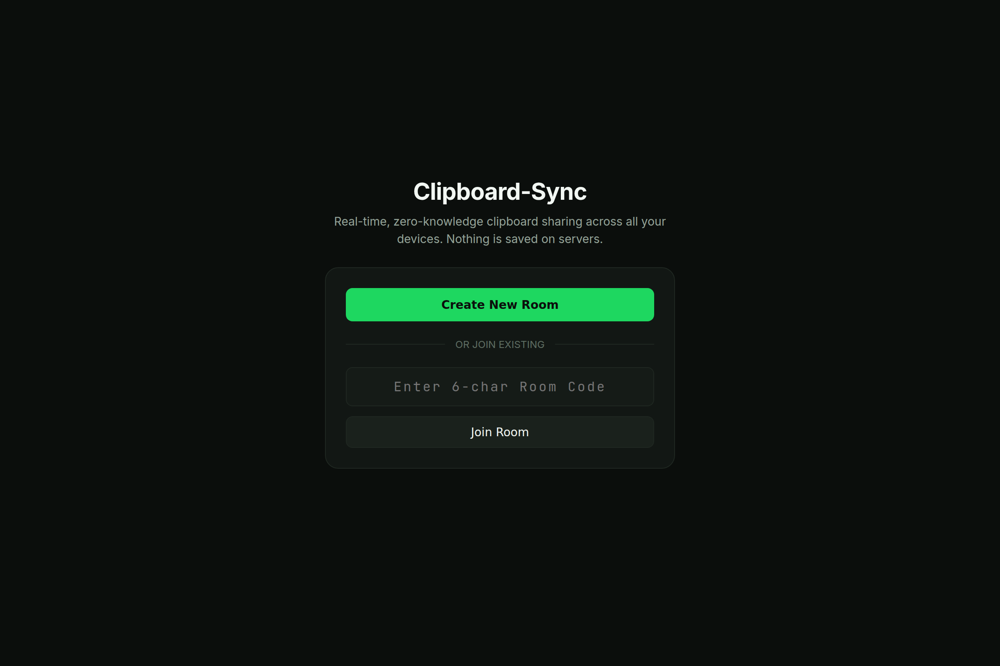
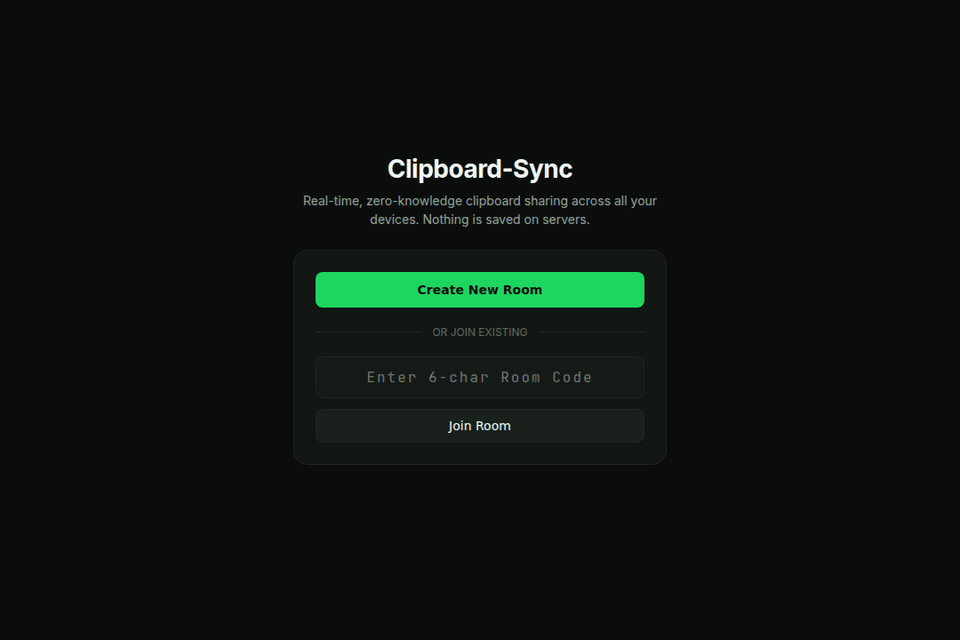

<div align="center">

# Clipboard-Sync

> Real-time, zero-knowledge, multi-device clipboard synchronization powered by Cloudflare Workers, Durable Objects, and Web Crypto AES-GCM-256.

[](LICENSE)
[](https://www.typescriptlang.org/)
[](https://react.dev/)
[](https://workers.cloudflare.com/)
[](https://developer.mozilla.org/en-US/docs/Web/API/Web_Crypto_API)
[](https://github.com/0xReLogic/Clipboard-Sync)

<br />

[Live Demo](https://your-domain.com) | [Documentation](https://your-domain.com/#docs) | [Report Bug](https://github.com/0xReLogic/Clipboard-Sync/issues) | [Request Feature](https://github.com/0xReLogic/Clipboard-Sync/issues)

<br />
<br />



</div>

---

## Interactive Walkthrough

<p align="center">
  
</p>

---

## Why Clipboard-Sync?

Sharing text, code snippets, tokens, and screenshots between computers and mobile devices is still surprisingly painful:

- **Proprietary Lock-in:** Apple Universal Clipboard only works within the Apple ecosystem.
- **Privacy Liabilities:** Standard cloud clipboard apps store sensitive passwords, API keys, and personal messages in remote databases.
- **P2P Network Failures:** WebRTC-based tools (like Snapdrop or PairDrop) often fail when devices are on different networks, behind corporate firewalls, or using mobile cellular data (Symmetric NAT).

**Clipboard-Sync solves all three:**
1. **Works Everywhere:** Runs directly in any modern browser on Windows, macOS, Linux, iOS, and Android.
2. **Zero-Knowledge E2EE:** All payloads are encrypted client-side using AES-GCM-256 before leaving your device. Keys live strictly in the URL hash fragment (`#key=...`) and are never sent to the server.
3. **Zero Server Storage:** The Cloudflare backend holds **zero bytes of persistent data** (no database, no disk writes). Data exists exclusively in the volatile RAM of active client browsers.
4. **100% Reliable Transport:** Utilizes Cloudflare Anycast WebSocket relays to establish sub-50ms connections across mobile cellular networks and strict firewalls.

---

## Key Features

- **Instant Ad-Hoc Pairing:** Join rooms instantly with 6-character Crockford Base32 room codes or a 1-second QR code scan with your smartphone camera.
- **Multi-Format Clipboard:** Synchronize plain text, code blocks, and image screenshots (PNG/JPEG/WebP up to 5MB) via direct `Ctrl+V` paste or file picker.
- **Pure Ephemeral State:** When all devices close their browser tabs, the room and all its clipboard data permanently self-destruct.
- **Peer-to-Peer State Transfer:** Late-joining devices receive clipboard history directly from the RAM of an active peer through a blind relay.
- **Bounded RAM Footprint:** Client browsers maintain a strict 20-item ring buffer with automatic bitmap cleanup (`URL.revokeObjectURL`) to prevent memory leaks.
- **Mobile Safari Optimized:** Uses synchronous clipboard write execution with fallback mechanisms to bypass mobile user gesture expiration.
- **Installable PWA:** Supports Progressive Web App installation on Android, iOS (Add to Home Screen), macOS, and Windows for a fullscreen, native app feel.
- **Near-Zero Operating Cost:** Powered by Cloudflare's WebSocket Hibernation API. The server sleeps when idle, resulting in virtually zero compute billing.

---

## Security Model and Cryptography

Clipboard-Sync is architected with a strict Zero-Knowledge posture:

| Component | Specification | Security Guarantee |
| :--- | :--- | :--- |
| **Cipher Algorithm** | AES-GCM-256 (Web Crypto API) | Authenticated encryption with 128-bit integrity tag. |
| **Key Location** | URL Hash Fragment (`#key=...`) | Per RFC 3986, fragments are processed locally by the browser and are never transmitted in HTTP headers (`Referer`, `Host`). |
| **Nonce Policy** | 96-bit (12-byte) Cryptographic Nonce | Generated freshly for every single message via `crypto.getRandomValues()` to eliminate IV reuse risks. |
| **Server Visibility** | Blind Relay | Cloudflare Workers only forward opaque ciphertext blobs and have no ability to decrypt payloads. |
| **Persistence** | 0 Bytes on Server | No SQLite, KV, or database storage on server infrastructure. |

---

## Architecture Overview

```
+---------------------------+                  +---------------------------+
|   Client A (Desktop Web)  |                  |    Client B (Mobile PWA)  |
| - Memory: Volatile RAM    |                  | - Memory: Volatile RAM    |
| - Key: In-Memory Hex Key  |                  | - Key: In-Memory Hex Key  |
| - Ring Buffer: 20 Items   |                  | - Ring Buffer: 20 Items   |
+-------------+-------------+                  +-------------+-------------+
              |                                              |
       WSS (Ciphertext)                               WSS (Ciphertext)
              |                                              |
              v                                              v
+--------------------------------------------------------------------------+
| Cloudflare Global Anycast Edge Network                                   |
|                                                                          |
|   +------------------------------------------------------------------+   |
|   | Worker Gateway (`apps/worker/src/index.ts`)                      |   |
|   | - Consistent Hash Resolution                                     |   |
|   | - Geo-Optimization via `locationHint` (Nearest Data Center)       |   |
|   +---------------------------------+--------------------------------+   |
|                                     | DO Binding                         |
|                                     v                                    |
|   +------------------------------------------------------------------+   |
|   | Durable Object Relay (`apps/worker/src/relay.ts`)                |   |
|   | - Zero Storage Bindings (No Database, No Disk I/O)               |   |
|   | - WebSocket Hibernation API (Zero Idle Compute Cost)             |   |
|   | - Tagged Connection Routing (`ctx.acceptWebSocket`)              |   |
|   | - Automatic Edge Ping/Pong Responses                             |   |
|   +------------------------------------------------------------------+   |
+--------------------------------------------------------------------------+
```

---

## Tech Stack

- **Edge Runtime:** [Cloudflare Workers](https://workers.cloudflare.com/) + [Durable Objects](https://developers.cloudflare.com/durable-objects/) (WebSocket Hibernation)
- **Frontend Framework:** [React 19](https://react.dev/) + [Vite](https://vitejs.dev/) + [TypeScript](https://www.typescriptlang.org/)
- **Styling:** Vanilla CSS Design System (LamarKita Obsidian Theme)
- **Cryptography:** Native Web Crypto API (`window.crypto.subtle`)
- **Transport:** Full-Duplex WebSockets (`wss://`)
- **Tooling:** npm Workspaces Monorepo

---

## Quick Start (Local Development)

### Prerequisites
- Node.js 20+
- npm 10+
- Cloudflare Wrangler CLI (bundled in devDependencies)

### 1. Clone and Install
```bash
git clone https://github.com/0xReLogic/Clipboard-Sync.git
cd Clipboard-Sync
npm install
```

### 2. Run Automated Integration Tests
Verify that the WebSocket relay, encryption, and state transfer protocols pass all checks:
```bash
npm run test:integration
```

### 3. Start Development Servers
Start both the Cloudflare Worker relay and the Vite frontend simultaneously:

In terminal 1 (Worker Relay on port 8787):
```bash
npm run dev:worker
```

In terminal 2 (Vite Frontend on port 5173):
```bash
npm run dev:web
```

Open `http://localhost:5173` in your browser.

---

## Keyboard Shortcuts

- `Ctrl + Enter` (or `Cmd + Enter`): Send typed text or code to the room instantly.
- `Ctrl + V` (or `Cmd + V`): Paste an image screenshot directly from your clipboard anywhere on the page.
- `Esc`: Close open modal windows (QR Code Pairing modal).

---

## Deployment Guide

### Deploying the Backend (Cloudflare Workers)

1. Authenticate with Wrangler:
   ```bash
   npx wrangler login
   ```
2. Deploy the Worker and Durable Object:
   ```bash
   cd apps/worker
   npx wrangler deploy
   ```

### Deploying the Frontend (Cloudflare Pages)

1. Build the production web bundle:
   ```bash
   cd apps/web
   npm run build
   ```
2. Deploy the generated `dist/` directory to Cloudflare Pages:
   ```bash
   npx wrangler pages deploy dist --project-name=clipboard-sync
   ```

Alternatively, connect your GitHub repository directly to Cloudflare Pages with build command `npm run build` and output directory `apps/web/dist`.

---

## Project Structure

```
clipboard-sync/
+-- apps/
|   +-- web/                     # React 19 Frontend (PWA)
|   |   +-- public/              # Manifest, Service Worker, SVG Icons
|   |   +-- src/
|   |       +-- components/      # UI Components (Header, Cards, Modals)
|   |       +-- context/         # Clipboard Context & E2EE State Orchestrator
|   |       +-- lib/             # Crypto, Ring Buffer, and Clipboard Handler
|   |       +-- styles/          # LamarKita Obsidian Design Tokens
|   |
|   +-- worker/                  # Cloudflare Worker & Durable Object Relay
|       +-- src/
|           +-- index.ts         # Edge Gateway, CORS, and Routing
|           +-- relay.ts         # Zero-Storage Hibernated Durable Object
|
+-- packages/
|   +-- shared/                  # Shared TypeScript Contracts & Protocol Schemas
|
+-- test-integration.mjs         # Headless WebSocket Integration Test Suite
+-- package.json                 # Monorepo Workspaces Configuration
+-- tsconfig.base.json           # Shared TypeScript Configuration
```

---

## Contributing

Contributions are welcome. Please ensure all TypeScript typechecks and integration tests pass before submitting a pull request:

```bash
npm run typecheck
npm run test:integration
npm run build
```

---

## License

This project is licensed under the MIT License. See [LICENSE](LICENSE) for details.